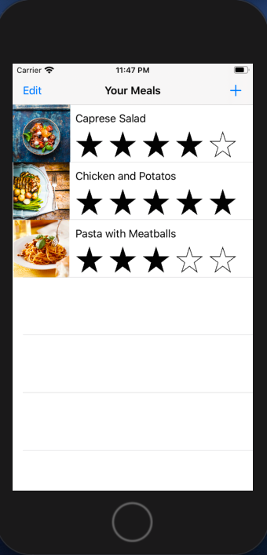

# Meal Tracker

This application created only for educational purpose.

If you want to learn how to build this app from scratch you can visit [guided project](https://developer.apple.com/library/archive/referencelibrary/GettingStarted/DevelopiOSAppsSwift/index.html#//apple_ref/doc/uid/TP40015214-CH2-SW1)

Data persistence was implemented via Codable protocol instead of NSCoding
