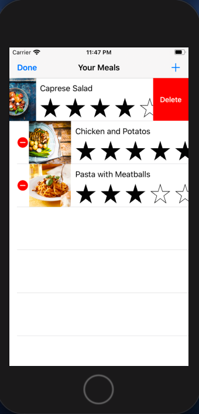
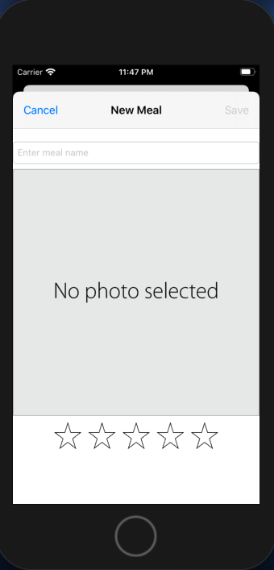
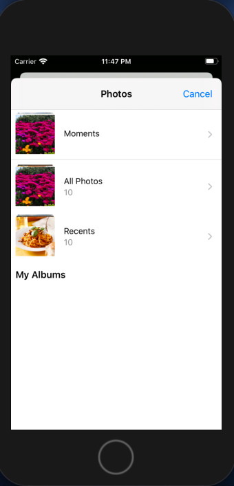
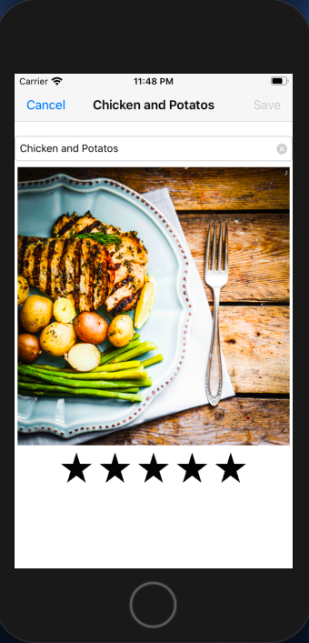

# Meal Tracker

This application was created only for educational purposes.

If you want to learn how to build this app from scratch you can visit [guided project](https://developer.apple.com/library/archive/referencelibrary/GettingStarted/DevelopiOSAppsSwift/index.html#//apple_ref/doc/uid/TP40015214-CH2-SW1)
## Requirements: 
* Xcode 11 
* Swift 5.0 +

## About
You can keep track of your favorite meals by adding, deleting or editing items. You also can rate them by giving corresponding number of stars. It's also available to choose images for meal from your photo library.

## Screenshots
    Screenshots must be viewed from left to right and then down.

 

 

  

###### Data persistence was implemented via Codable protocol instead of NSCoding
